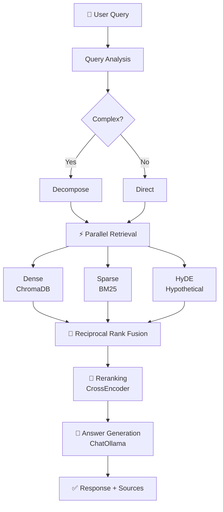
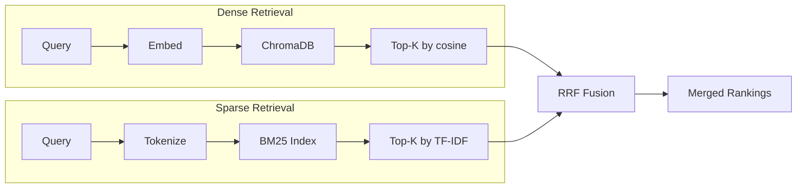
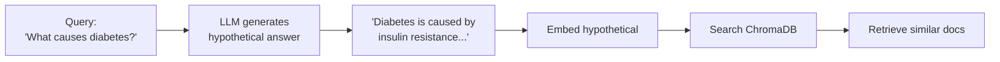
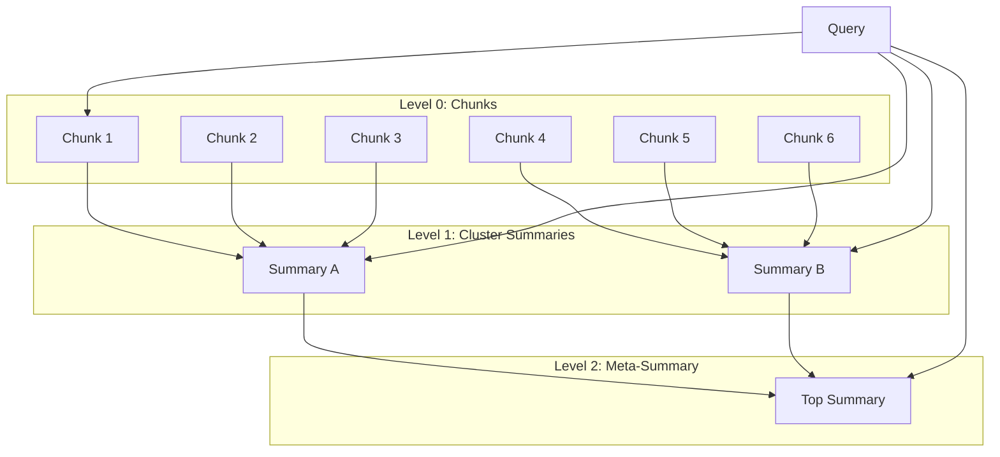
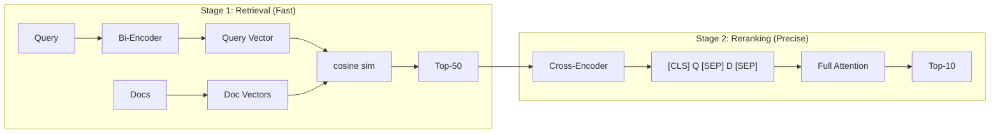
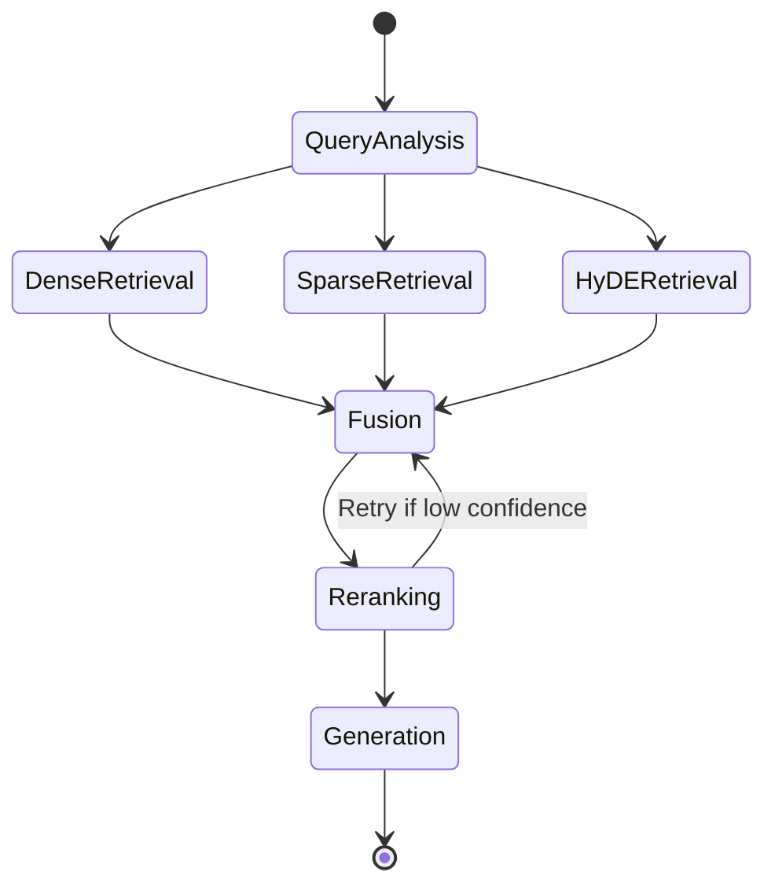

# Modular RAG - Production Ready RAG System

A modular, production-ready Retrieval-Augmented Generation (RAG) system built with Ollama for LLM and embeddings. Features HyDE, RAPTOR, hybrid search, and LangGraph orchestration.

  

---

## 🎯 Why This RAG?

Most RAG implementations use a simple pattern that **fails in production**:

| Problem                                             | Naive RAG                   | This System               |
| --------------------------------------------------- | --------------------------- | ------------------------- |
| Query "heart attack" vs doc "myocardial infarction" | ❌ Misses match             | ✅ HyDE bridges vocab gap |
| User searches "error 0x80070005"                    | ❌ Embeddings fail on codes | ✅ BM25 handles lexical   |
| Answer needs info from 3 sections                   | ❌ Fragments context        | ✅ RAPTOR clusters docs   |
| Top-10 has 5 irrelevant chunks                      | ❌ Dilutes quality          | ✅ Cross-encoder reranks  |

---

## 🏗️ System Architecture


<details>
<summary>📋 Text-based diagram (for terminals)</summary>

```
┌─────────────────────────────────────────────────────────────┐
│                        FastAPI Layer                         │
│                    POST /query | WS /ws/query                │
└──────────────────────────┬──────────────────────────────────┘
                           │
                           ▼
┌─────────────────────────────────────────────────────────────┐
│                  LangGraph Orchestrator                     │
│   Query Analysis → Retrieve ×3 → Fuse → Rerank → Generate   │
└──────────────────────────┬──────────────────────────────────┘
                           │
       ┌───────────────────┼───────────────────┐
       │                   │                   │
       ▼                   ▼                   ▼
┌─────────────┐    ┌─────────────┐    ┌─────────────┐
│  Retrieval  │    │  Reranking  │    │ Generation  │
├─────────────┤    ├─────────────┤    ├─────────────┤
│ HybridSearch│    │CrossEncoder │    │ AnswerGen   │
│ HyDE        │    │ ColBERT     │    │ Synthesizer │
│ RAPTOR      │    └─────────────┘    └─────────────┘
└─────────────┘
    └────────────────────────────────────────────┘
                            │
                            │
                            ▼
┌─────────────────────────────────────────────────────────────┐
│                       Core Layer                            │
│   LLMWrapper (ChatOllama) | EmbeddingWrapper | Config       │
└─────────────────────────────────────────────────────────────┘
                           │
                           ▼
┌─────────────────────────────────────────────────────────────┐
│                   Infrastructure Layer                      │
│       Ollama Server | ChromaDB | File System                │
└─────────────────────────────────────────────────────────────┘
```

</details>

---

## 🔄 Query Processing Flow

### Step-by-Step Flow



---

## 🧠 How Each Component Works

### 1. Hybrid Search (BM25 + Dense)



**Why both?**

- **Dense** catches semantic similarity ("car" ≈ "automobile")
- **Sparse** catches exact matches ("error 0x80070005")

---

### 2. HyDE (Hypothetical Document Embeddings)



**Why?** Transforms short queries into document-style embeddings for better matching.

---

### 3. RAPTOR (Hierarchical Retrieval)



**Why?** Enables multi-hop reasoning by clustering related chunks.

---

### 4. Two-Stage Reranking



**Why?** Bi-encoders are fast but miss query-doc interactions. Cross-encoders see the full context.

---

### 5. LangGraph State Machine



**Why LangGraph over chains?**

- Parallel execution (3 retrievers simultaneously)
- State persistence across steps
- Error recovery and retries

---

## ⚡ Quick Start

```bash
# Clone
git clone https://github.com/pankajshakya627/modular-rag-ollama.git
cd modular-rag-ollama

# Install
pip install -r requirements.txt
pip install -e .

# Start Ollama
ollama pull llama3:8b
ollama pull nomic-embed-text
ollama serve

# Run API
python -m src.main --mode api --port 8000
```

---

## 🔌 API Endpoints

Base URL: `http://localhost:8000`

### Overview

| Method   | Endpoint     | Description               | Working Logic                                                           |
| -------- | ------------ | ------------------------- | ----------------------------------------------------------------------- |
| `GET`    | `/health`    | System health check       | Checks LLM, Embedding, Vector Store connectivity                        |
| `POST`   | `/query`     | RAG query processing      | Runs LangGraph workflow (Analyze → Retrieve → Rerank → Generate)        |
| `POST`   | `/index`     | Index documents           | Splits file into chunks, embeds them, stores in ChromaDB with UUID v7   |
| `GET`    | `/search`    | Vector similarity search  | Performs hybrid search (Sparse+Dense) or direct dense search on vectors |
| `GET`    | `/documents` | List indexed documents    | Aggregates chunks by `document_id` metadata                             |
| `GET`    | `/stats`     | System statistics         | Counts total documents and chunks in store                              |
| `DELETE` | `/documents` | Delete specific documents | Removes all chunks with matching `document_id`                          |
| `DELETE` | `/index`     | Clear entire index        | Drops and recreates the ChromaDB collection                             |

---

### `GET /health` — System Health Check

**Working:**

- Pings the Ollama server to verify LLM and Embedding models are loaded.
- Checks if ChromaDB persistence directory exists and is accessible.
- Returns status of all sub-systems.

```bash
curl http://localhost:8000/health
```

**Response:**

```json
{
  "status": "healthy",
  "version": "1.0.0",
  "llm_available": true,
  "embedding_available": true,
  "vector_store_stats": {
    "document_count": 42,
    "chunk_count": 1250
  }
}
```

---

### `POST /query` — RAG Query Processing

**Working:**

1. **Query Analysis:** Decomposes complex queries into sub-queries (if enabled).
2. **Retrieval:** Executes Hybrid Search (BM25 + Dense) and HyDE (Hypothetical Document Embeddings) in parallel.
3. **Fusion:** Combines results using Reciprocal Rank Fusion (RRF).
4. **Reranking:** Re-scores top results using a Cross-Encoder for high precision.
5. **Generation:** Synthesizes answer using the top-k context via ChatOllama.

```bash
curl -X POST http://localhost:8000/query \
  -H "Content-Type: application/json" \
  -d '{"query": "What is Modular RAG?"}'
```

**Request Body:**

```json
{
  "query": "What is Modular RAG?",
  "use_hyde": true, // Enable/disable HyDE
  "use_decomposition": true // Enable/disable query decomposition
}
```

**Response:**

```json
{
  "query": "What is Modular RAG?",
  "answer": "Modular RAG is a production-ready RAG system...",
  "confidence": 0.87,
  "sources": [
    { "document_id": "doc_001", "chunk_id": 3, "score": 0.92 },
    { "document_id": "doc_002", "chunk_id": 7, "score": 0.85 }
  ],
  "workflow_stage": "completed",
  "decomposed_queries": ["What is RAG?", "What makes it modular?"],
  "stepback_query": "What are RAG systems?",
  "processing_time": 1.23
}
```

---

### `POST /index` — Index Documents

**Working:**

1. **Ingestion:** Reads file (PDF, DOCX, TXT) or recursively traverses directory.
2. **Chunking:** Splits text using Recursive or Semantic chunking strategies.
3. **ID Generation:** Assigns **UUID v7** (time-sortable) to documents and chunks.
4. **Embedding:** Generates vector embeddings for each chunk via Ollama.
5. **Storage:** Inserts chunks, embeddings, and metadata into ChromaDB.

```bash
# Index a single file
curl -X POST http://localhost:8000/index \
  -H "Content-Type: application/json" \
  -d '{"file_path": "/path/to/document.pdf"}'

# Index a directory recursively
curl -X POST http://localhost:8000/index \
  -H "Content-Type: application/json" \
  -d '{"file_path": "/path/to/docs/", "recursive": true}'
```

**Response:**

```json
{
  "success": true,
  "documents_indexed": 5,
  "chunks_created": 127,
  "message": "Indexed 5 documents successfully"
}
```

---

### `GET /search` — Vector Similarity Search

**Working:**

- Performs a direct similarity search on the vector store.
- Supports pure Dense Retrieval by default.
- Useful for debugging retrieval quality without the RAG generation step.

```bash
curl "http://localhost:8000/search?query=machine%20learning&top_k=5"
```

**Query Parameters:**

- `query` (required): Search query string
- `top_k` (optional): Number of results (1-100, default 10)

**Response:**

```json
{
  "query": "machine learning",
  "results": [
    {
      "id": "chunk_123",
      "content": "Machine learning is a subset of AI...",
      "score": 0.89,
      "document_id": "doc_001",
      "metadata": { "source": "ml_intro.pdf", "page": 3 }
    }
  ],
  "total_results": 5
}
```

---

### `GET /documents` — List Indexed Documents

**Working:**

- Scans all chunks in ChromaDB.
- Aggregates chunks based on `metadata.document_id`.
- Reconstructs a summary of stored documents (path, type, chunk count).

```bash
curl http://localhost:8000/documents
```

**Response:**

```json
[
  {
    "id": "doc_001",
    "content_preview": "Introduction to RAG systems...",
    "source_type": "pdf",
    "source_path": "/data/documents/rag_intro.pdf",
    "chunk_count": 25
  }
]
```

---

### `GET /stats` — System Statistics

**Working:**

- Returns the total count of unique Documents.
- Returns the total number of Chunks (vector entries).
- Estimates index size.

```bash
curl http://localhost:8000/stats
```

**Response:**

```json
{
  "total_documents": 42,
  "total_chunks": 1250,
  "index_size_mb": 45.2
}
```

---

### `DELETE /documents` — Delete Specific Documents

**Working:**

1. Accepts a list of `document_ids`.
2. Queries ChromaDB for all chunks where `metadata.document_id` matches the input IDs.
3. Deletes the matching chunks from the collection.
4. **Note:** Does not delete the original source file from disk.

```bash
curl -X DELETE http://localhost:8000/documents \
  -H "Content-Type: application/json" \
  -d '{"document_ids": ["doc_001", "doc_002"]}'
```

**Response:**

```json
{
  "success": true,
  "documents_deleted": 2
}
```

---

### `DELETE /index` — Clear Entire Index

**Working:**

1. Connects to the ChromaDB client.
2. **Drops** the `modular_rag_documents` collection entirely.
3. Re-creates a fresh, empty collection with the same settings.
4. **Warning:** This is destructive and irreversible.

```bash
curl -X DELETE http://localhost:8000/index
```

**Response:**

```json
{
  "success": true,
  "message": "Index cleared successfully"
}
```

---

## 🐍 Python Usage

```python
from src.components.orchestration.rag_graph import ModularRAGWorkflow

workflow = ModularRAGWorkflow()
result = workflow.query("What is RAG?")

print(result["answer"])
print(f"Confidence: {result['confidence']}")
print(f"Sources: {result['sources']}")
```

---

## 📁 Project Structure

```
modular-rag-ollama/
├── src/
│   ├── core/                 # LLM, Embedding, Config
│   ├── components/
│   │   ├── retrieval/        # VectorStore, HyDE, RAPTOR, Hybrid
│   │   ├── reranking/        # CrossEncoder, ColBERT
│   │   ├── generation/       # AnswerGenerator
│   │   └── orchestration/    # LangGraph workflow
│   └── api/                  # FastAPI endpoints
├── config/config.yaml        # Configuration
├── docs/                     # HLD, LLD, Architecture
└── tests/                    # Pytest tests
```

---

## ⚙️ Configuration

```yaml
# config/config.yaml
llm:
  model: "llama3:8b"
  base_url: "http://localhost:11434"

embedding:
  model: "nomic-embed-text"

hyde:
  enabled: true
  temperature: 0.3

hybrid_search:
  fusion_method: "rrf" # rrf, weighted
  alpha: 0.5

raptor:
  enabled: true
  num_clusters: 5
```

---

## 📚 Documentation

| Document                                | Description                                              |
| --------------------------------------- | -------------------------------------------------------- |
| [HLD.md](docs/HLD.md)                   | High-Level Design with architecture and design decisions |
| [LLD.md](docs/LLD.md)                   | Low-Level Design with class specifications               |
| [ARCHITECTURE.md](docs/ARCHITECTURE.md) | Visual diagrams and flow charts                          |

---

## 🧪 Testing

```bash
pytest tests/ -v
pytest tests/ --cov=src --cov-report=html
```

---

## 🚀 Deployment

### Docker

```dockerfile
FROM python:3.11-slim
WORKDIR /app
COPY requirements.txt .
RUN pip install --no-cache-dir -r requirements.txt
COPY . .
CMD ["python", "-m", "src.main", "--mode", "api", "--host", "0.0.0.0"]
```

### Docker Compose

```yaml
services:
  ollama:
    image: ollama/ollama
    ports: ["11434:11434"]

  rag-api:
    build: .
    depends_on: [ollama]
    environment:
      OLLAMA_BASE_URL: http://ollama:11434
    ports: ["8000:8000"]
```

---

## 📄 License

MIT License - see [LICENSE](LICENSE) for details.

---

## 🙏 Acknowledgments

- [LangChain](https://github.com/langchain-ai/langchain) - RAG abstractions
- [LangGraph](https://github.com/langchain-ai/langgraph) - Workflow orchestration
- [Ollama](https://ollama.com/) - Local LLM serving
- [ChromaDB](https://www.trychroma.com/) - Vector storage
