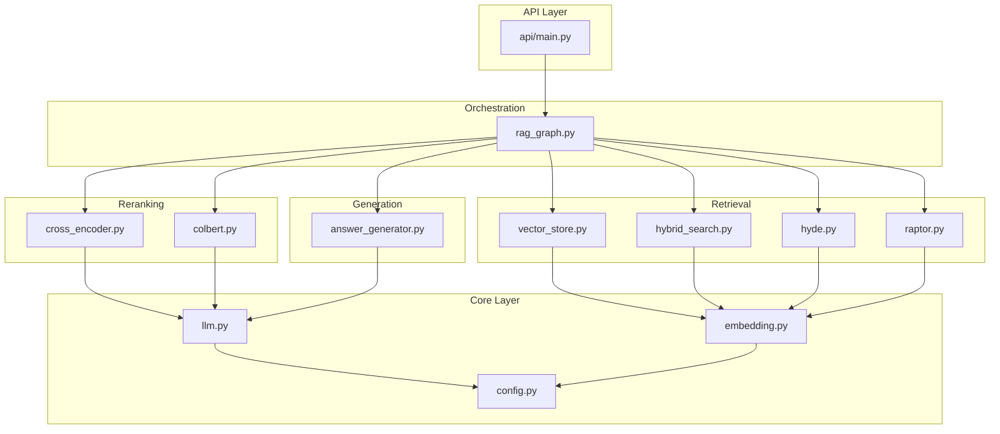
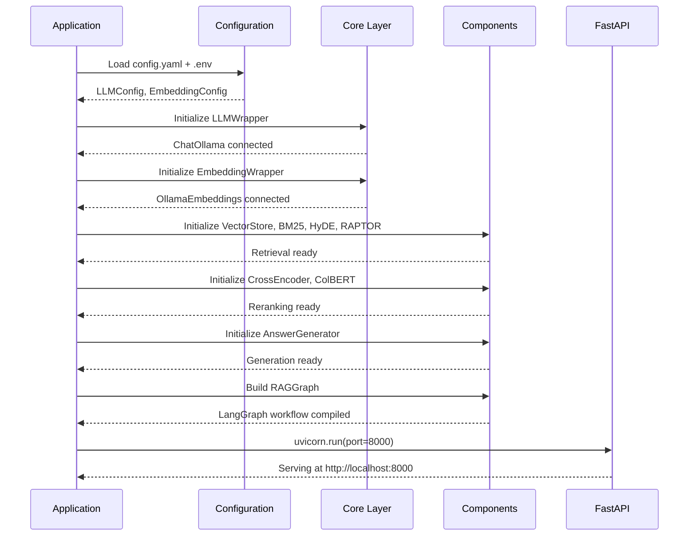

# System Architecture

This document provides visual architecture diagrams and component interaction flows for the **modular-rag-ollama** framework.

> [!TIP]
> The SVG diagrams below are **animated**. Open them in a browser to see data flow animations.

---

## 🏛️ Layered Architecture



<details>
<summary>📌 ASCII Fallback (for terminals)</summary>

```
┌────────────────────────────────────────────────────────────────────────────────────┐
│                                  PRESENTATION LAYER                                │
│  ┌─────────────────────────────────────────────────────────────────────────────┐   │
│  │                           FastAPI Application                               │   │
│  │   ┌─────────────┐  ┌─────────────┐  ┌─────────────┐  ┌─────────────┐        │   │
│  │   │ POST /query │  │POST /docs   │  │ GET /health │  │ WS /ws/query│        │   │
│  │   └─────────────┘  └─────────────┘  └─────────────┘  └─────────────┘        │   │
│  └─────────────────────────────────────────────────────────────────────────────┘   │
└────────────────────────────────────────┬───────────────────────────────────────────┘
                                         │
                                         ▼
┌────────────────────────────────────────────────────────────────────────────────────┐
│                                ORCHESTRATION LAYER                                 │
│  ┌─────────────────────────────────────────────────────────────────────────────┐   │
│  │                        LangGraph State Machine                              │   │
│  │   ┌────────┐    ┌────────┐    ┌────────┐    ┌────────┐    ┌────────┐        │   │
│  │   │ Query  │───▶│Retrieve│───▶│ Fuse   │───▶│Rerank  │───▶│Generate│        │   │
│  │   │Analysis│    │  ×3   │    │Results │    │Top-K   │    │ Answer │         │   │
│  │   └────────┘    └────────┘    └────────┘    └────────┘    └────────┘        │   │
│  └─────────────────────────────────────────────────────────────────────────────┘   │
└────────────────────────────────────────┬───────────────────────────────────────────┘
                                         │
      ┌──────────────────────────────────┼──────────────────────────────────┐
      │                                  │                                  │
      ▼                                  ▼                                  ▼
┌───────────────┐              ┌───────────────────┐              ┌───────────────┐
│  RETRIEVAL    │              │    RERANKING      │              │  GENERATION   │
├───────────────┤              ├───────────────────┤              ├───────────────┤
│ VectorStore   │              │ CrossEncoder      │              │ AnswerGen     │
│ BM25 Searcher │              │ ColBERT           │              │ Synthesizer   │
│ HyDE          │              │                   │              │               │
│ RAPTOR        │              │                   │              │               │
└───────────────┘              └───────────────────┘              └───────────────┘
                                         │
                                         ▼
┌─────────────────────────────────────────────────────────────────────────────────────┐
│                                    CORE LAYER                                       │
│   LLMWrapper (ChatOllama)  |  EmbeddingWrapper (OllamaEmbeddings)  |  Config        │
└─────────────────────────────────────────────────────────────────────────────────────┘
                                         │
                                         ▼
┌─────────────────────────────────────────────────────────────────────────────────────┐
│                               INFRASTRUCTURE LAYER                                  │
│       Ollama Server       |        ChromaDB         |       File System             │
└─────────────────────────────────────────────────────────────────────────────────────┘
```

</details>

---

## 🔄 Query Processing Flow



### Flow Description

| Stage                     | Components               | Output              |
| ------------------------- | ------------------------ | ------------------- |
| **1. Query Analysis**     | Decomposition, Step-back | Sub-queries, intent |
| **2. Parallel Retrieval** | Dense, Sparse, HyDE      | 3× result sets      |
| **3. Fusion**             | Reciprocal Rank Fusion   | Merged rankings     |
| **4. Reranking**          | CrossEncoder/ColBERT     | Precision-sorted    |
| **5. Generation**         | ChatOllama + context     | Answer + sources    |

---

## 🔗 Component Interaction



### Key Interactions

```
FastAPI ──▶ RAGGraph ──┬──▶ Retrieval Components ──▶ VectorStoreManager
                       │
                       ├──▶ Reranking Components
                       │
                       └──▶ Generation Components ──▶ LLMWrapper
```

---

## 📁 Module Dependency Graph



---

## 🗄️ Data Storage

```
data/
├── documents/           # Raw input documents (PDF, DOCX, TXT)
└── vector_store/        # ChromaDB persistence (SQLite + embeddings)

config/
└── config.yaml          # Runtime configuration

.env                     # Secrets (OLLAMA_BASE_URL, etc.)
```

---

## 🔧 Initialization Sequence



---

## 🚀 Deployment

### Local Development

```bash
ollama serve              # Start Ollama
python -m src.main --mode api --port 8000
```

### Docker (Recommended)

```yaml
services:
  ollama:
    image: ollama/ollama
    ports: ["11434:11434"]
    volumes: [ollama_data:/root/.ollama]

  rag-api:
    build: .
    depends_on: [ollama]
    environment:
      OLLAMA_BASE_URL: http://ollama:11434
    ports: ["8000:8000"]
    volumes: [./data:/app/data]
```

---

## ⚡ Performance & Security

| Aspect            | Consideration    | Mitigation    |
| ----------------- | ---------------- | ------------- |
| **Embedding**     | O(N) per doc     | Batch, async  |
| **Vector Search** | Index size       | HNSW tuning   |
| **Reranking**     | O(K) per query   | ColBERT/GPU   |
| **LLM**           | Token latency    | Streaming     |
| **Security**      | Prompt injection | Sanitization  |
| **Secrets**       | API keys         | .env, not Git |
