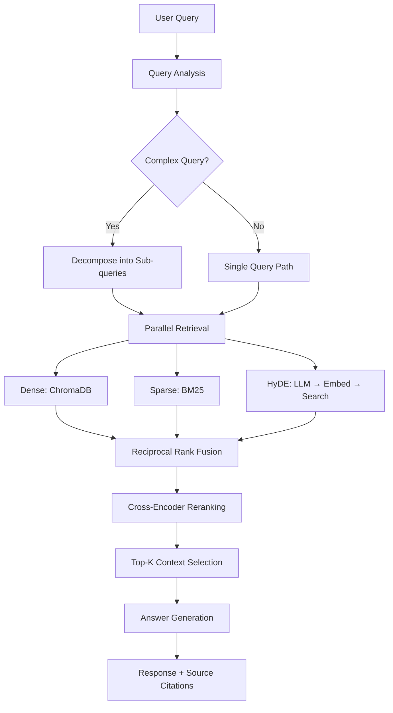

# High-Level Design (HLD)

## 📌 Overview

**modular-rag-ollama** is a production-grade Retrieval-Augmented Generation (RAG) framework designed for **local-first AI** applications. It combines state-of-the-art retrieval techniques with LLM-powered generation, all running **completely locally** using Ollama.

---

## 🎯 Why This Architecture?

### The Problem with Naive RAG

Most RAG tutorials show a simple pattern:

```
Query → Embed → Vector Search → Top-K → LLM → Answer
```

**This fails in production because:**

| Failure Mode              | Real-World Example                                                            | Impact                      |
| ------------------------- | ----------------------------------------------------------------------------- | --------------------------- |
| **Vocabulary mismatch**   | User asks "heart attack" but docs say "myocardial infarction"                 | Misses relevant documents   |
| **Keyword blindness**     | User asks for "error code 0x80070005" - embeddings don't understand hex codes | Returns generic content     |
| **Context fragmentation** | Answer requires info from 3 different paragraphs                              | Incomplete or wrong answers |
| **Retrieval noise**       | Top-10 includes 5 irrelevant but semantically similar chunks                  | Dilutes context quality     |
| **Single-point failure**  | One retrieval method = one perspective                                        | No redundancy, no fusion    |

### Our Solution: Defense in Depth

This architecture implements **multiple retrieval strategies** that compensate for each other's weaknesses:

```
                ┌─────────────────────────────────────────┐
                │           Query Analysis                │
                │   (Decomposition + Step-back + HyDE)    │
                └──────────────────┬──────────────────────┘
                                   │
          ┌────────────────────────┼────────────────────────┐
          │                        │                        │
          ▼                        ▼                        ▼
   ┌───────────────┐       ┌────────────────┐       ┌───────────────┐
   │Dense Retrieval│       │Sparse Retrieval│       │   HyDE        │
   │  (Semantic)   │       │    (BM25)      │       │ (Hypothetical)│
   └──────┬────────┘       └─────┬──────────┘       └───┬───────────┘
          │                      │                      │
          └──────────────────────┴──────────────────────┘
                                 │
                    ┌────────────▼─────────────┐
                    │   Reciprocal Rank Fusion │
                    │   (Combine & Deduplicate)│
                    └────────────┬─────────────┘
                                 │
                    ┌────────────▼─────────────┐
                    │     Cross-Encoder        │
                    │     Reranking            │
                    └────────────┬─────────────┘
                                 │
                    ┌────────────▼─────────────┐
                    │   Answer Generation      │
                    │   with Source Citation   │
                    └──────────────────────────┘
```

---

## 🧠 Design Decisions & Justifications

### 1. Why Hybrid Search (BM25 + Dense)?

#### The Problem

Dense embeddings are **blind to exact matches**. When a user searches for:

- `"pandas DataFrame.merge() TypeError"`
- `"CUDA error 999"`
- `"RFC 7231 section 4.3.3"`

Embeddings capture **semantic meaning**, not **lexical precision**. These queries need exact keyword matching.

#### Why BM25 Specifically?

| Algorithm  | Pros                                    | Cons                                  | Our Choice |
| ---------- | --------------------------------------- | ------------------------------------- | ---------- |
| **TF-IDF** | Simple, fast                            | No length normalization, outdated     | ❌         |
| **BM25**   | Length-normalized, proven in production | Requires tokenization                 | ✅         |
| **BM25+**  | Handles long docs better                | Marginal improvement, more complexity | ❌         |

#### Why Not Just Use BM25?

BM25 fails on semantic queries:

- `"how to fix memory issues"` won't match `"optimize RAM usage"`
- `"authentication problems"` won't match `"login failures"`

**Hybrid fusion gives you BOTH:**

```
BM25 Score (lexical) + Dense Score (semantic) → RRF → Best of both worlds
```

---

### 2. Why HyDE (Hypothetical Document Embeddings)?

#### The Problem

Queries and documents live in **different embedding spaces**:

| Query (short, question-style) | Document (long, declarative-style)                             |
| ----------------------------- | -------------------------------------------------------------- |
| "What causes diabetes?"       | "Diabetes mellitus is a metabolic disease characterized by..." |
| 15 tokens                     | 500+ tokens                                                    |
| Question intent               | Factual explanation                                            |

The cosine similarity between these is **lower than it should be** because they're stylistically different.

#### How HyDE Fixes This

1. User asks: `"What causes diabetes?"`
2. LLM generates hypothetical answer: `"Diabetes is primarily caused by insulin resistance in type 2, or autoimmune destruction of beta cells in type 1..."`
3. Embed the **hypothetical answer** (not the query)
4. Search for similar documents

**The hypothetical answer is in "document space"**, so it matches real documents better.

#### Why Not Multi-Query Expansion?

| Approach            | Mechanism                            | Trade-off                             |
| ------------------- | ------------------------------------ | ------------------------------------- |
| **Query Expansion** | Generate synonyms/related terms      | Only adds keywords, not context       |
| **Multi-Query**     | Generate 3-5 variations of the query | Still query-style, not document-style |
| **HyDE**            | Generate a full hypothetical answer  | Bridges the semantic gap completely   |

**HyDE is the only approach that transforms query embeddings into document embeddings.**

---

### 3. Why RAPTOR (Hierarchical Summarization)?

#### The Problem

Flat retrieval fails on **multi-hop questions**:

> "Compare the security features of OAuth 2.0 and SAML across different enterprise use cases"

This requires synthesizing information from:

- OAuth 2.0 section (paragraphs 1-3)
- SAML section (paragraphs 8-10)
- Enterprise deployment section (paragraphs 15-17)

With flat retrieval, you get fragments. With RAPTOR, you get **cluster summaries** that already synthesize related content.

#### How RAPTOR Works

```
Level 0: [Chunk1] [Chunk2] [Chunk3] [Chunk4] [Chunk5] [Chunk6]
              ↓       ↓       ↓         ↓       ↓       ↓
Level 1:     [  Cluster A Summary  ]    [  Cluster B Summary  ]
                        ↓                         ↓
Level 2:          [  Meta-Summary (Top-Level)  ]
```

**Queries can match at any level**, retrieving the right granularity automatically.

#### Why Not Just Bigger Chunks?

| Approach                  | Problem                                                    |
| ------------------------- | ---------------------------------------------------------- |
| Bigger chunks (4K tokens) | Dilutes context with irrelevant content                    |
| Overlapping chunks        | Redundancy, still fragments                                |
| **RAPTOR**                | Semantic clustering + LLM summarization = coherent context |

---

### 4. Why Two-Stage Reranking?

#### The Problem with Retrieval Scores

Vector similarity scores are **not calibrated** for relevance:

- Score of 0.85 ≠ 85% relevant
- A chunk about "Python lists" might score 0.82 against "Python arrays"
- A chunk about "grocery lists" might score 0.79 against "Python arrays"

The **0.03 difference** doesn't reflect the **actual relevance gap**.

#### Why Cross-Encoder?

```
Bi-Encoder (Retrieval):     Query →[Embed]→ Q_vec
                            Doc   →[Embed]→ D_vec
                            Score = cosine(Q_vec, D_vec)
                            ⚠️ Encodes separately, misses interaction

Cross-Encoder (Reranking):  [CLS] Query [SEP] Doc [SEP] → BERT → Score
                            ✅ Full attention over query+doc together
```

Cross-encoders see the **full interaction** between query and document, catching nuances that bi-encoders miss.

#### Why ColBERT as Alternative?

| Reranker          | Latency   | Quality   | Use Case           |
| ----------------- | --------- | --------- | ------------------ |
| **Cross-Encoder** | ~50ms/doc | Highest   | Small top-K (≤20)  |
| **ColBERT**       | ~5ms/doc  | Very High | Large top-K (≤100) |

We include **both** so users can choose based on their latency requirements.

---

### 5. Why LangGraph Over LangChain Chains?

#### The Problem with Chains

LangChain's `Chain` abstraction is **linear**:

```python
chain = prompt | llm | parser  # Just a pipeline
```

Real RAG workflows need:

- **Conditional branching** (decompose query or not?)
- **Parallel execution** (run 3 retrievers simultaneously)
- **State persistence** (remember what was retrieved)
- **Error recovery** (retry failed steps)

#### Why LangGraph?

LangGraph treats workflows as **state machines**:

```python
class GraphState(TypedDict):
    query: str
    dense_results: List[SearchResult]
    sparse_results: List[SearchResult]
    hyde_results: List[SearchResult]
    reranked_results: List[RerankedResult]
    answer: str
    errors: List[str]

graph = StateGraph(GraphState)
graph.add_node("dense_retrieval", dense_retrieve)
graph.add_node("sparse_retrieval", sparse_retrieve)
graph.add_node("hyde_retrieval", hyde_retrieve)
graph.add_node("fusion", fuse_results)
graph.add_edge("dense_retrieval", "fusion")
graph.add_edge("sparse_retrieval", "fusion")
graph.add_edge("hyde_retrieval", "fusion")
```

| Feature             | LangChain Chains | LangGraph              |
| ------------------- | ---------------- | ---------------------- |
| Parallel execution  | ❌               | ✅                     |
| Conditional routing | Limited          | ✅ Native              |
| State persistence   | ❌               | ✅ MemorySaver         |
| Visualization       | ❌               | ✅ Built-in            |
| Error handling      | Try/except       | ✅ Graph-level retries |

---

### 6. Why Ollama for Local LLMs?

#### The Problem with Cloud APIs

| Concern          | Cloud LLMs (OpenAI, Anthropic) | Local (Ollama)               |
| ---------------- | ------------------------------ | ---------------------------- |
| **Privacy**      | Data leaves your network       | Data stays local             |
| **Cost**         | ~$0.01-0.06 per 1K tokens      | Free after hardware          |
| **Latency**      | Network round-trip (~200ms+)   | Local inference (~50ms TTFT) |
| **Availability** | Dependent on API uptime        | Always available             |
| **Rate limits**  | Throttled during peak          | No limits                    |

#### Why Ollama Specifically?

| Local LLM Server          | Pros                                    | Cons                      |
| ------------------------- | --------------------------------------- | ------------------------- |
| **llama.cpp**             | Fastest, most optimized                 | No REST API, CLI-only     |
| **vLLM**                  | Best throughput for batching            | Heavy setup, GPU required |
| **text-generation-webui** | Feature-rich UI                         | Overkill for API use      |
| **Ollama**                | Simple CLI + REST API, model management | Slightly less optimized   |

**Ollama wins on developer experience** - one command to pull and run any model:

```bash
ollama pull llama3:8b
ollama serve  # REST API on :11434
```

---

### 7. Why ChromaDB for Vector Storage?

| Vector DB    | Deployment           | Performance   | Features                    |
| ------------ | -------------------- | ------------- | --------------------------- |
| **Pinecone** | Cloud-only           | Excellent     | Managed, expensive          |
| **Weaviate** | Self-hosted or cloud | Good          | GraphQL, complex            |
| **Milvus**   | Self-hosted          | Best at scale | Heavy, needs cluster        |
| **FAISS**    | In-memory            | Fastest       | No persistence, no metadata |
| **ChromaDB** | Embedded or server   | Good          | Simple, SQLite persistence  |

**ChromaDB is the right fit because:**

1. **Embedded mode** - runs in-process, no separate server
2. **SQLite persistence** - survives restarts without setup
3. **Metadata filtering** - filter by source, date, document type
4. **Python-native** - first-class LangChain integration

---

## 🔄 Complete Data Flow



---

## 🛠️ Technology Stack Justification

| Layer             | Technology   | Why This Choice                           |
| ----------------- | ------------ | ----------------------------------------- |
| **LLM**           | Ollama       | Local-first, simple API, model management |
| **Orchestration** | LangGraph    | State machines > linear chains            |
| **Chains**        | LCEL         | Modern, composable, streaming-native      |
| **Vector Store**  | ChromaDB     | Embedded, SQLite persistence, metadata    |
| **Sparse Search** | rank_bm25    | Fast, proven, length-normalized           |
| **Reranking**     | Transformers | Cross-encoder + ColBERT options           |
| **API**           | FastAPI      | Async, OpenAPI docs, WebSocket            |
| **Config**        | Pydantic     | Type-safe, validation, .env support       |

---

## 📁 Project Structure

```
modular-rag-ollama/
├── src/
│   ├── core/               # LLM, Embedding, Config
│   ├── components/
│   │   ├── retrieval/      # Vector store, HyDE, RAPTOR, Hybrid
│   │   ├── reranking/      # CrossEncoder, ColBERT
│   │   ├── generation/     # Answer generator, Response synthesizer
│   │   └── orchestration/  # LangGraph RAG workflow
│   ├── api/                # FastAPI endpoints
│   └── utils/              # Evaluation metrics
├── config/                 # YAML configuration
├── data/                   # Documents and vector store
├── tests/                  # Pytest tests
└── docs/                   # HLD, LLD, Architecture
```
