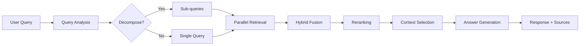

# High-Level Design (HLD)

## 📌 Overview

**modular-rag-ollama** is a production-grade Retrieval-Augmented Generation (RAG) framework designed for **local-first AI** applications. It combines state-of-the-art retrieval techniques with LLM-powered generation, all running **completely locally** using Ollama.

### Why This Project Exists

Traditional RAG implementations suffer from several issues:

| Problem                                    | Our Solution                                   |
| ------------------------------------------ | ---------------------------------------------- |
| Basic keyword/vector search misses context | **Hybrid Search** (BM25 + Dense vectors)       |
| Query-document vocabulary mismatch         | **HyDE** (Hypothetical Document Embeddings)    |
| Flat document retrieval lacks hierarchy    | **RAPTOR** (Recursive Abstractive Processing)  |
| Initial retrieval quality is "good enough" | **Reranking** (Cross-Encoder, ColBERT)         |
| Simple pipelines lack flexibility          | **LangGraph** orchestration for stateful flows |
| Cloud dependency for LLMs                  | **Ollama** for 100% local execution            |

---

## 🏗️ System Architecture

```
┌─────────────────────────────────────────────────────────────────────────────┐
│                              FastAPI Layer                                  │
│                         (REST API + WebSocket)                              │
└───────────────────────────────────┬─────────────────────────────────────────┘
                                    │
                                    ▼
┌─────────────────────────────────────────────────────────────────────────────┐
│                         LangGraph Orchestrator                              │
│                    (State Machine for RAG Pipeline)                         │
│  ┌──────────┐  ┌──────────┐  ┌──────────┐  ┌──────────┐  ┌──────────┐      │
│  │  Query   │→ │Retrieval │→ │ Rerank   │→ │ Generate │→ │ Response │      │
│  │ Analysis │  │  Stage   │  │  Stage   │  │  Stage   │  │ Synthesis│      │
│  └──────────┘  └──────────┘  └──────────┘  └──────────┘  └──────────┘      │
└───────────────────────────────────┬─────────────────────────────────────────┘
                                    │
        ┌───────────────────────────┼───────────────────────────┐
        │                           │                           │
        ▼                           ▼                           ▼
┌───────────────┐         ┌───────────────┐         ┌───────────────┐
│   Retrieval   │         │   Reranking   │         │  Generation   │
│  Components   │         │  Components   │         │  Components   │
├───────────────┤         ├───────────────┤         ├───────────────┤
│ • Vector Store│         │ • CrossEncoder│         │ • AnswerGen   │
│ • BM25 Search │         │ • ColBERT     │         │ • Response    │
│ • HyDE        │         │               │         │   Synthesizer │
│ • RAPTOR      │         │               │         │               │
│ • Hybrid      │         │               │         │               │
└───────────────┘         └───────────────┘         └───────────────┘
        │                                                   │
        │                                                   │
        ▼                                                   ▼
┌───────────────────────────────────────────────────────────────────────────┐
│                              Core Layer                                   │
│  ┌─────────────────┐    ┌─────────────────┐    ┌─────────────────┐       │
│  │   LLMWrapper    │    │ EmbeddingWrapper│    │  Configuration  │       │
│  │  (ChatOllama)   │    │ (OllamaEmbed)   │    │    (YAML)       │       │
│  └─────────────────┘    └─────────────────┘    └─────────────────┘       │
└───────────────────────────────────────────────────────────────────────────┘
                                    │
                                    ▼
                     ┌─────────────────────────────┐
                     │      Ollama Server          │
                     │  (Local LLM + Embeddings)   │
                     └─────────────────────────────┘
```

---

## 🧩 Major Components

### 1. Core Layer

| Component          | Purpose                               | Technology                          |
| ------------------ | ------------------------------------- | ----------------------------------- |
| `LLMWrapper`       | Unified interface for text generation | `langchain-ollama.ChatOllama`       |
| `EmbeddingWrapper` | Unified interface for embeddings      | `langchain-ollama.OllamaEmbeddings` |
| `Configuration`    | YAML-based settings management        | Pydantic Settings                   |

**Why ChatOllama over basic Ollama?**

- Supports chat-style message history
- Returns structured `AIMessage` objects
- Better integration with LangChain Expression Language (LCEL)

---

### 2. Document Processing

| Chunker            | When to Use              | How It Works                                        |
| ------------------ | ------------------------ | --------------------------------------------------- |
| `RecursiveChunker` | General documents        | Splits by hierarchy: paragraphs → sentences → words |
| `SemanticChunker`  | Context-aware splitting  | Groups sentences by embedding similarity            |
| `FixedSizeChunker` | Predictable token counts | Hard splits at N characters + overlap               |

**Issue Solved:** Naive fixed-size chunking breaks semantic meaning. Recursive and semantic chunkers preserve context boundaries.

---

### 3. Retrieval Components

#### Vector Store (`LangChainChromaVectorStore`)

- **What:** Stores document embeddings for similarity search
- **How:** Uses ChromaDB with Ollama embeddings
- **Why:** Fast approximate nearest neighbor search at scale

#### Hybrid Search

- **What:** Combines sparse (BM25) + dense (vector) retrieval
- **How:** Reciprocal Rank Fusion (RRF) to merge rankings
- **Why:** BM25 catches exact keyword matches that embeddings miss

#### HyDE (Hypothetical Document Embeddings)

- **What:** Generates a "fake answer" and searches for similar docs
- **How:** LLM writes hypothetical content → embed → search
- **Why:** Bridges vocabulary gap between queries and documents

#### RAPTOR (Recursive Abstractive Processing for Tree-Organized Retrieval)

- **What:** Builds a hierarchical summary tree over documents
- **How:** Clusters chunks → generates summaries → clusters summaries
- **Why:** Enables multi-hop reasoning across document sections

---

### 4. Reranking Components

| Reranker               | Approach                      | Trade-off              |
| ---------------------- | ----------------------------- | ---------------------- |
| `CrossEncoderReranker` | Full attention over query+doc | High accuracy, slower  |
| `ColBERTReranker`      | Late interaction (MaxSim)     | Balanced speed/quality |

**Issue Solved:** Initial retrieval is fast but imprecise. Rerankers add a second-stage precision boost on the top-K candidates.

---

### 5. Generation Components

| Component             | Purpose                                                |
| --------------------- | ------------------------------------------------------ |
| `AnswerGenerator`     | Generates answers from context with source attribution |
| `ResponseSynthesizer` | Merges outputs from multiple retrieval methods         |

---

### 6. Orchestration (LangGraph)

The `RAGGraph` class implements a **state machine** using LangGraph:

```
START → Query Analysis → [Dense Retrieval, Sparse Retrieval, HyDE] →
        Fusion → Reranking → Generation → END
```

**Why LangGraph?**

- Explicit control flow (not just chains)
- State persistence across steps
- Easy to add retries, loops, and conditional branches

---

## 🔄 Data Flow



---

## 🛠️ Technology Stack

| Layer         | Technology               |
| ------------- | ------------------------ |
| LLM           | Ollama (local)           |
| Orchestration | LangGraph                |
| Chains        | LangChain Core (LCEL)    |
| Vector Store  | ChromaDB                 |
| Sparse Search | rank_bm25                |
| Reranking     | HuggingFace Transformers |
| API           | FastAPI + Uvicorn        |
| Config        | Pydantic Settings + YAML |

---

## 📁 Project Structure

```
modular-rag-ollama/
├── src/
│   ├── core/               # LLM, Embedding, Config
│   ├── components/
│   │   ├── retrieval/      # Vector store, HyDE, RAPTOR, Hybrid
│   │   ├── reranking/      # CrossEncoder, ColBERT
│   │   ├── generation/     # Answer generator, Response synthesizer
│   │   └── orchestration/  # LangGraph RAG workflow
│   ├── api/                # FastAPI endpoints
│   └── utils/              # Evaluation metrics
├── config/                 # YAML configuration
├── data/                   # Documents and vector store
├── tests/                  # Pytest tests
└── docs/                   # HLD, LLD, Architecture
```
