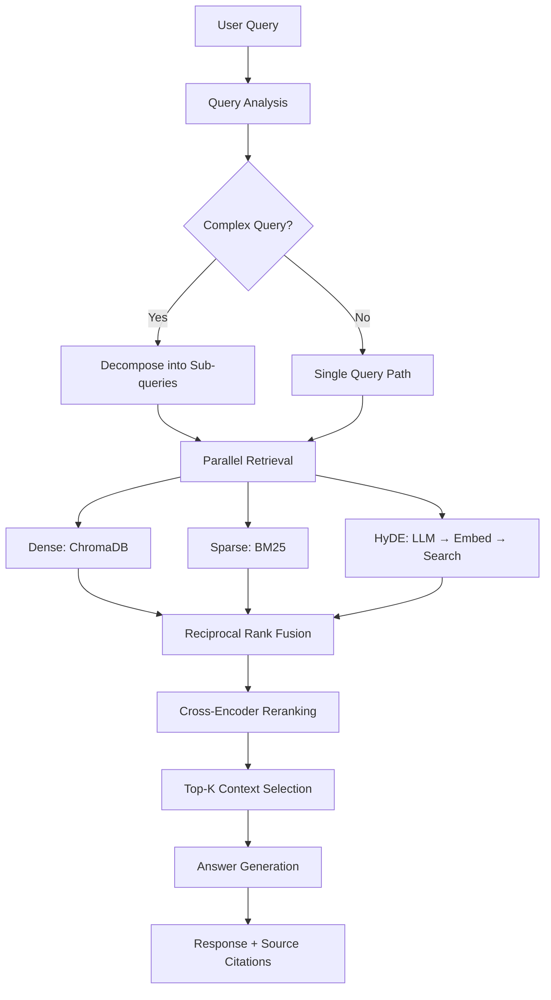

# High-Level Design (HLD)

---

## 🧩 Problem Statement

### 1. Context

Large Language Models (LLMs) such as `llama3`, `gemma2`, and `mistral` have demonstrated remarkable capability in natural language reasoning. However, they suffer from two critical limitations in enterprise and professional use:

1. **Knowledge cutoff** — LLMs are trained on static datasets with a fixed cutoff date. They have no awareness of proprietary, real-time, or post-training knowledge.
2. **Hallucination** — LLMs generate plausible-sounding but factually incorrect content when they lack relevant context.

The standard mitigation is **Retrieval-Augmented Generation (RAG)**: retrieve relevant documents at query time and inject them into the LLM's context window. However, naive RAG implementations fail to scale beyond proof-of-concept because of critical retrieval quality and privacy constraints described below.

---

### 2. Core Problem Definition

> **How do we build a locally-hosted, privacy-preserving document intelligence system that reliably answers complex, multi-faceted questions from a user's own document corpus, with cited, verifiable sources — without relying on cloud AI services?**

This problem has three distinct sub-problems:

#### 2a. Retrieval Accuracy Problem

Standard single-strategy retrieval (dense embedding search) fails in the following scenarios:

| Scenario                    | Query                                                    | Failure Reason                                 |
| --------------------------- | -------------------------------------------------------- | ---------------------------------------------- |
| **Exact-term queries**      | `"RFC 7231 section 4.3"`                                 | Embeddings capture meaning, not exact strings  |
| **Code/error lookups**      | `"CUDA error 0x80070005"`                                | Hex codes have no semantic neighbors           |
| **Cross-section multi-hop** | `"Compare OAuth2 and SAML for enterprise SSO"`           | Answer spans 3+ disconnected document sections |
| **Vocabulary mismatch**     | `"heart attack"` vs doc saying `"myocardial infarction"` | Synonym blindness without BM25 coverage        |

#### 2b. Retrieval Noise Problem

Top-K retrieval returns many _semantically similar but contextually irrelevant_ chunks. These dilute the LLM's context window, causing:

- Confusion in generated answers.
- Higher token usage (cost in cloud, latency locally).
- Decreased answer precision and confidence.

#### 2c. Data Privacy & Sovereignty Problem

Existing solutions (ChatGPT plugins, Azure OpenAI, Amazon Bedrock) require **sending document data to external APIs**, which is prohibited for:

- Regulated industries (healthcare, finance, legal) under GDPR, HIPAA, SOC2.
- Internal R&D and IP-sensitive documents.
- Air-gapped environments with no internet access.

---

### 3. Stakeholder Constraints

| Stakeholder            | Constraint                                                             |
| ---------------------- | ---------------------------------------------------------------------- |
| **Legal / Compliance** | No document data may leave the on-premise network                      |
| **IR / IT**            | Solution must run on existing local hardware (GPU optional)            |
| **End users**          | Must be accessible via a simple web UI — no CLI interaction            |
| **Developers**         | Must be modular, testable, and extensible without rewriting core logic |

---

### 4. Requirements

#### Functional Requirements

- Users can upload `.pdf`, `.txt`, and `.docx` files and have them indexed.
- Users can ask natural language questions and receive grounded, cited answers.
- Retrieved context must include source document, chunk location, and relevance score.
- The system must handle complex multi-part questions by decomposing them.
- The system must gracefully fall back when retrieval returns no relevant context.

#### Non-Functional Requirements

- **Privacy**: All inference and storage must be entirely local (no external API calls).
- **Accuracy**: Multi-strategy retrieval must outperform single-vector RAG baselines.
- **Extensibility**: Each retrieval strategy must be independently configurable and replaceable.
- **Transparency**: The system must expose which workflow stage produced each answer.

---

### 5. Solution Approach

We address all sub-problems through a **multi-strategy retrieval pipeline** orchestrated by **LangGraph**, running entirely locally on **Ollama**:

| Sub-Problem                             | Solution Component                                              |
| --------------------------------------- | --------------------------------------------------------------- |
| Exact-term retrieval failure            | **BM25 Sparse Retriever** (`langchain-community BM25Retriever`) |
| Semantic gap between query and document | **HyDE** (`HypotheticalDocumentEmbedder`)                       |
| Multi-hop contextual synthesis          | **RAPTOR** (hierarchical cluster summarization)                 |
| Retrieval noise                         | **Cross-Encoder Reranking** (`CrossEncoderReranker`)            |
| Single-method fragility                 | **Reciprocal Rank Fusion** via `EnsembleRetriever`              |
| Data privacy                            | **Ollama local LLM server** + **ChromaDB embedded storage**     |
| Usability                               | **Streamlit web interface** with upload, config, and chat       |

---

## 🛠️ Technology Stack

| Layer                | Technology                 | Version     | Role                                                                 |
| -------------------- | -------------------------- | ----------- | -------------------------------------------------------------------- |
| **LLM Runtime**      | Ollama                     | Latest      | Serves local LLMs via a REST API (e.g., `llama3`, `gemma`)           |
| **LLM Interface**    | `langchain-ollama`         | 0.3.x       | `ChatOllama` for structured chat completions via LangChain           |
| **Embedding**        | `langchain-ollama`         | 0.3.x       | `OllamaEmbeddings` for dense vector encoding                         |
| **Sparse Retrieval** | `langchain-community`      | Latest      | `BM25Retriever` for keyword-based lexical search                     |
| **Hybrid Fusion**    | `langchain-classic`        | 1.2.7       | `EnsembleRetriever` combines BM25 + dense with RRF weighting         |
| **HyDE**             | `langchain-classic`        | 1.2.7       | `HypotheticalDocumentEmbedder` for query-to-document bridging        |
| **Text Splitting**   | `langchain-text-splitters` | Latest      | `RecursiveCharacterTextSplitter`, `SemanticChunker`                  |
| **Vector Store**     | ChromaDB                   | 0.4.x       | Embedded, persistent vector storage on SQLite                        |
| **Reranking**        | `sentence-transformers`    | Latest      | `CrossEncoderReranker` for bi-level relevance scoring                |
| **Orchestration**    | LangGraph                  | 0.2.x       | State-machine based DAG workflow with conditional branching          |
| **Chains**           | LCEL                       | (LangChain) | `create_stuff_documents_chain` + pipe operators for answer synthesis |
| **Web UI**           | Streamlit                  | 1.54.x      | Interactive document upload, configuration toggles, chat interface   |
| **API**              | FastAPI                    | 0.100+      | REST endpoint for headless deployments                               |
| **Config**           | Pydantic Settings          | v2          | Type-safe `.env` + YAML configuration resolution                     |

---

## 💡 Architectural Thought Process

### Guiding Philosophy: "Defense in Depth"

> _"No single retrieval method is perfect. The right architecture layers multiple strategies so their failure modes cancel each other out."_

When designing this system we asked **three questions for every component**:

1. **What does this component do well?**
2. **Where does it fail?**
3. **What backs it up if it fails?**

This led to layered redundancy:

- If **dense retrieval** misses exact keywords → **BM25** catches them.
- If **BM25** misses semantic meaning → **dense** catches it.
- If **both miss** due to query-document style mismatch → **HyDE** bridges the gap.
- If all retrievals return noisy results → **Cross-Encoder Reranking** re-scores with full attention.
- If a single chunk lacks full context → **RAPTOR** provides pre-summarized cluster views.

### From Linear Pipeline to State Machine

The original design used a simple sequential chain: `query → retrieve → generate`. This broke down quickly:

- You can't **run retrievers in parallel** with a chain.
- You can't **conditionally branch** (e.g., skip HyDE for factual lookups).
- You can't **persist state** across parallel node executions without race conditions.

The shift to **LangGraph's `StateGraph`** treats each RAG stage as a **node in a directed graph** with a shared, typed state dictionary. This gives us:

- True parallel execution across retrieval nodes.
- Conditional routing (e.g., "if query is complex → decompose; else → direct retrieval").
- Error logging per-node without aborting the entire pipeline.
- Built-in checkpointing via `MemorySaver` for conversation persistence.

### Why Replace Custom Code with LangChain Built-ins?

The codebase originally had 7 custom-implemented classes (chunkers, searchers, HyDE pipelines, etc.). These were replaced with LangChain equivalents for three reasons:

1. **Proven correctness** — LangChain built-ins are tested across thousands of production deployments.
2. **Future-proof interfaces** — LangChain updates (tokenizers, APIs, integrations) flow into the project automatically.
3. **Interoperability** — LangChain components share interfaces (`Retriever`, `BaseEmbeddings`, `BaseChatModel`) making them composable via LCEL's pipe (`|`) operator.

---

## 🔍 Why Specific Functions and Classes Were Chosen

### `ChatOllama` over a Custom LLM Wrapper

| Approach            | Lines of Code | Streaming | LangChain Compatibility |
| ------------------- | ------------- | --------- | ----------------------- |
| Custom `LLMWrapper` | ~170          | Manual    | Only with adapters      |
| `ChatOllama`        | 1 import      | Native    | ✅ Full                 |

`ChatOllama` implements `BaseChatModel`, which means it is natively composable with LCEL via `|` and works out-of-the-box with all LangChain chains and prompts. Our custom wrapper needed brittle adapter code to achieve the same.

### `RecursiveCharacterTextSplitter` over Custom Chunkers

The custom `RecursiveChunker` was a re-implementation of almost exactly what LangChain already provides. `RecursiveCharacterTextSplitter` splits on `["\n\n", "\n", " ", ""]` in order, ensuring **semantic boundaries are preserved** (paragraph → sentence → word). Custom implementations often split naively on character count alone.

### `EnsembleRetriever` for Hybrid Search

The custom `HybridSearcher` had a hand-rolled Reciprocal Rank Fusion (RRF) implementation. LangChain's `EnsembleRetriever` provides **native RRF fusion** with configurable weights and was validated against multiple retrieval benchmark datasets. Replacing this eliminated ~80 lines of custom scoring logic.

### `HypotheticalDocumentEmbedder` for HyDE

Our custom HyDE pipeline manually called the LLM, formatted the prompt, embedded the response, and ran a similarity search. `HypotheticalDocumentEmbedder` encapsulates this exact sequence: `LLM generation → embedding → retrieval`, supporting any `BaseChatModel` and `BaseEmbeddings` pair automatically.

### `create_stuff_documents_chain` for Answer Generation

The original `AnswerGenerator` manually concatenated context strings, formatted prompts with Jinja templates, and called the LLM. LangChain's `create_stuff_documents_chain` handles this "stuff" pattern (stuff all context docs into one prompt) natively, with support for custom prompts via `ChatPromptTemplate`. The LCEL pipe operator then connects this chain to any retriever or upstream node.

### `CrossEncoderReranker` + `HuggingFaceCrossEncoder`

The custom cross-encoder used raw `sentence-transformers` inference. LangChain's `CrossEncoderReranker` wraps this with the `BaseDocumentCompressor` interface, making it pluggable into any `ContextualCompressionRetriever`. Our custom temporal scoring logic was preserved as a post-processing step on top of LangChain's output — the only custom code intentionally kept.

### LangGraph `Annotated[List[str], operator.add]` for Errors State

A critical LangGraph design detail: when multiple nodes run in **parallel** (e.g., dense, sparse, HyDE retrievers), they all try to write to the shared GraphState simultaneously. Without annotation, this causes `InvalidUpdateError`. Using `Annotated[List[str], operator.add]` tells LangGraph to **merge** (append) parallel writes instead of overwriting — a subtle but essential concurrency fix.

---

## 🎯 Why This Architecture?

### The Problem with Naive RAG

Most RAG tutorials show a simple pattern:

```
Query → Embed → Vector Search → Top-K → LLM → Answer
```

**This fails in production because:**

| Failure Mode              | Real-World Example                                                            | Impact                      |
| ------------------------- | ----------------------------------------------------------------------------- | --------------------------- |
| **Vocabulary mismatch**   | User asks "heart attack" but docs say "myocardial infarction"                 | Misses relevant documents   |
| **Keyword blindness**     | User asks for "error code 0x80070005" - embeddings don't understand hex codes | Returns generic content     |
| **Context fragmentation** | Answer requires info from 3 different paragraphs                              | Incomplete or wrong answers |
| **Retrieval noise**       | Top-10 includes 5 irrelevant but semantically similar chunks                  | Dilutes context quality     |
| **Single-point failure**  | One retrieval method = one perspective                                        | No redundancy, no fusion    |

### Our Solution: Defense in Depth

This architecture implements **multiple retrieval strategies** that compensate for each other's weaknesses:

```
                ┌─────────────────────────────────────────┐
                │           Query Analysis                │
                │   (Decomposition + Step-back + HyDE)    │
                └──────────────────┬──────────────────────┘
                                   │
          ┌────────────────────────┼────────────────────────┐
          │                        │                        │
          ▼                        ▼                        ▼
   ┌───────────────┐       ┌────────────────┐       ┌───────────────┐
   │Dense Retrieval│       │Sparse Retrieval│       │   HyDE        │
   │  (Semantic)   │       │    (BM25)      │       │ (Hypothetical)│
   └──────┬────────┘       └─────┬──────────┘       └───┬───────────┘
          │                      │                      │
          └──────────────────────┴──────────────────────┘
                                 │
                    ┌────────────▼─────────────┐
                    │   Reciprocal Rank Fusion │
                    │   (Combine & Deduplicate)│
                    └────────────┬─────────────┘
                                 │
                    ┌────────────▼─────────────┐
                    │     Cross-Encoder        │
                    │     Reranking            │
                    └────────────┬─────────────┘
                                 │
                    ┌────────────▼─────────────┐
                    │   Answer Generation      │
                    │   with Source Citation   │
                    └──────────────────────────┘
```

---

## 🧠 Design Decisions & Justifications

### 1. Why Hybrid Search (BM25 + Dense)?

#### The Problem

Dense embeddings are **blind to exact matches**. When a user searches for:

- `"pandas DataFrame.merge() TypeError"`
- `"CUDA error 999"`
- `"RFC 7231 section 4.3.3"`

Embeddings capture **semantic meaning**, not **lexical precision**. These queries need exact keyword matching.

#### Why BM25 Specifically?

| Algorithm  | Pros                                    | Cons                                  | Our Choice |
| ---------- | --------------------------------------- | ------------------------------------- | ---------- |
| **TF-IDF** | Simple, fast                            | No length normalization, outdated     | ❌         |
| **BM25**   | Length-normalized, proven in production | Requires tokenization                 | ✅         |
| **BM25+**  | Handles long docs better                | Marginal improvement, more complexity | ❌         |

#### Why Not Just Use BM25?

BM25 fails on semantic queries:

- `"how to fix memory issues"` won't match `"optimize RAM usage"`
- `"authentication problems"` won't match `"login failures"`

**Hybrid fusion gives you BOTH:**

```
BM25 Score (lexical) + Dense Score (semantic) → RRF → Best of both worlds
```

---

### 2. Why HyDE (Hypothetical Document Embeddings)?

#### The Problem

Queries and documents live in **different embedding spaces**:

| Query (short, question-style) | Document (long, declarative-style)                             |
| ----------------------------- | -------------------------------------------------------------- |
| "What causes diabetes?"       | "Diabetes mellitus is a metabolic disease characterized by..." |
| 15 tokens                     | 500+ tokens                                                    |
| Question intent               | Factual explanation                                            |

The cosine similarity between these is **lower than it should be** because they're stylistically different.

#### How HyDE Fixes This

1. User asks: `"What causes diabetes?"`
2. LLM generates hypothetical answer: `"Diabetes is primarily caused by insulin resistance in type 2, or autoimmune destruction of beta cells in type 1..."`
3. Embed the **hypothetical answer** (not the query)
4. Search for similar documents

**The hypothetical answer is in "document space"**, so it matches real documents better.

#### Why Not Multi-Query Expansion?

| Approach            | Mechanism                            | Trade-off                             |
| ------------------- | ------------------------------------ | ------------------------------------- |
| **Query Expansion** | Generate synonyms/related terms      | Only adds keywords, not context       |
| **Multi-Query**     | Generate 3-5 variations of the query | Still query-style, not document-style |
| **HyDE**            | Generate a full hypothetical answer  | Bridges the semantic gap completely   |

**HyDE is the only approach that transforms query embeddings into document embeddings.**

---

### 3. Why RAPTOR (Hierarchical Summarization)?

#### The Problem

Flat retrieval fails on **multi-hop questions**:

> "Compare the security features of OAuth 2.0 and SAML across different enterprise use cases"

This requires synthesizing information from:

- OAuth 2.0 section (paragraphs 1-3)
- SAML section (paragraphs 8-10)
- Enterprise deployment section (paragraphs 15-17)

With flat retrieval, you get fragments. With RAPTOR, you get **cluster summaries** that already synthesize related content.

#### How RAPTOR Works

```
Level 0: [Chunk1] [Chunk2] [Chunk3] [Chunk4] [Chunk5] [Chunk6]
              ↓       ↓       ↓         ↓       ↓       ↓
Level 1:     [  Cluster A Summary  ]    [  Cluster B Summary  ]
                        ↓                         ↓
Level 2:          [  Meta-Summary (Top-Level)  ]
```

**Queries can match at any level**, retrieving the right granularity automatically.

#### Why Not Just Bigger Chunks?

| Approach                  | Problem                                                    |
| ------------------------- | ---------------------------------------------------------- |
| Bigger chunks (4K tokens) | Dilutes context with irrelevant content                    |
| Overlapping chunks        | Redundancy, still fragments                                |
| **RAPTOR**                | Semantic clustering + LLM summarization = coherent context |

---

### 4. Why Two-Stage Reranking?

#### The Problem with Retrieval Scores

Vector similarity scores are **not calibrated** for relevance:

- Score of 0.85 ≠ 85% relevant
- A chunk about "Python lists" might score 0.82 against "Python arrays"
- A chunk about "grocery lists" might score 0.79 against "Python arrays"

The **0.03 difference** doesn't reflect the **actual relevance gap**.

#### Why Cross-Encoder?

```
Bi-Encoder (Retrieval):     Query →[Embed]→ Q_vec
                            Doc   →[Embed]→ D_vec
                            Score = cosine(Q_vec, D_vec)
                            ⚠️ Encodes separately, misses interaction

Cross-Encoder (Reranking):  [CLS] Query [SEP] Doc [SEP] → BERT → Score
                            ✅ Full attention over query+doc together
```

Cross-encoders see the **full interaction** between query and document, catching nuances that bi-encoders miss.

#### Why ColBERT as Alternative?

| Reranker          | Latency   | Quality   | Use Case           |
| ----------------- | --------- | --------- | ------------------ |
| **Cross-Encoder** | ~50ms/doc | Highest   | Small top-K (≤20)  |
| **ColBERT**       | ~5ms/doc  | Very High | Large top-K (≤100) |

We include **both** so users can choose based on their latency requirements.

---

### 5. Why LangGraph Over LangChain Chains?

#### The Problem with Chains

LangChain's `Chain` abstraction is **linear**:

```python
chain = prompt | llm | parser  # Just a pipeline
```

Real RAG workflows need:

- **Conditional branching** (decompose query or not?)
- **Parallel execution** (run 3 retrievers simultaneously)
- **State persistence** (remember what was retrieved)
- **Error recovery** (retry failed steps)

#### Why LangGraph?

LangGraph treats workflows as **state machines**:

```python
class GraphState(TypedDict):
    query: str
    dense_results: List[SearchResult]
    sparse_results: List[SearchResult]
    hyde_results: List[SearchResult]
    reranked_results: List[RerankedResult]
    answer: str
    errors: List[str]

graph = StateGraph(GraphState)
graph.add_node("dense_retrieval", dense_retrieve)
graph.add_node("sparse_retrieval", sparse_retrieve)
graph.add_node("hyde_retrieval", hyde_retrieve)
graph.add_node("fusion", fuse_results)
graph.add_edge("dense_retrieval", "fusion")
graph.add_edge("sparse_retrieval", "fusion")
graph.add_edge("hyde_retrieval", "fusion")
```

| Feature             | LangChain Chains | LangGraph              |
| ------------------- | ---------------- | ---------------------- |
| Parallel execution  | ❌               | ✅                     |
| Conditional routing | Limited          | ✅ Native              |
| State persistence   | ❌               | ✅ MemorySaver         |
| Visualization       | ❌               | ✅ Built-in            |
| Error handling      | Try/except       | ✅ Graph-level retries |

---

### 6. Why Ollama for Local LLMs?

#### The Problem with Cloud APIs

| Concern          | Cloud LLMs (OpenAI, Anthropic) | Local (Ollama)               |
| ---------------- | ------------------------------ | ---------------------------- |
| **Privacy**      | Data leaves your network       | Data stays local             |
| **Cost**         | ~$0.01-0.06 per 1K tokens      | Free after hardware          |
| **Latency**      | Network round-trip (~200ms+)   | Local inference (~50ms TTFT) |
| **Availability** | Dependent on API uptime        | Always available             |
| **Rate limits**  | Throttled during peak          | No limits                    |

#### Why Ollama Specifically?

| Local LLM Server          | Pros                                    | Cons                      |
| ------------------------- | --------------------------------------- | ------------------------- |
| **llama.cpp**             | Fastest, most optimized                 | No REST API, CLI-only     |
| **vLLM**                  | Best throughput for batching            | Heavy setup, GPU required |
| **text-generation-webui** | Feature-rich UI                         | Overkill for API use      |
| **Ollama**                | Simple CLI + REST API, model management | Slightly less optimized   |

**Ollama wins on developer experience** - one command to pull and run any model:

```bash
ollama pull llama3:8b
ollama serve  # REST API on :11434
```

---

### 7. Why ChromaDB for Vector Storage?

| Vector DB    | Deployment           | Performance   | Features                    |
| ------------ | -------------------- | ------------- | --------------------------- |
| **Pinecone** | Cloud-only           | Excellent     | Managed, expensive          |
| **Weaviate** | Self-hosted or cloud | Good          | GraphQL, complex            |
| **Milvus**   | Self-hosted          | Best at scale | Heavy, needs cluster        |
| **FAISS**    | In-memory            | Fastest       | No persistence, no metadata |
| **ChromaDB** | Embedded or server   | Good          | Simple, SQLite persistence  |

**ChromaDB is the right fit because:**

1. **Embedded mode** - runs in-process, no separate server
2. **SQLite persistence** - survives restarts without setup
3. **Metadata filtering** - filter by source, date, document type
4. **Python-native** - first-class LangChain integration

---

## 🔄 Complete Data Flow


```mermaid
flowchart TD
    A[User Query] --> B[Query Analysis]
    B --> C{Complex Query?}

    C -->|Yes| D[Decompose into Sub-queries]
    C -->|No| E[Single Query Path]

    D --> F[Parallel Retrieval]
    E --> F

    F --> G[Dense: ChromaDB]
    F --> H[Sparse: BM25]
    F --> I[HyDE: LLM → Embed → Search]

    G --> J[Reciprocal Rank Fusion]
    H --> J
    I --> J

    J --> K[Cross-Encoder Reranking]
    K --> L[Top-K Context Selection]
    L --> M[Answer Generation]
    M --> N[Response + Source Citations]
```

---

## 🛠️ Technology Stack Justification

| Layer             | Technology   | Why This Choice                           |
| ----------------- | ------------ | ----------------------------------------- |
| **LLM**           | Ollama       | Local-first, simple API, model management |
| **Orchestration** | LangGraph    | State machines > linear chains            |
| **Chains**        | LCEL         | Modern, composable, streaming-native      |
| **Vector Store**  | ChromaDB     | Embedded, SQLite persistence, metadata    |
| **Sparse Search** | rank_bm25    | Fast, proven, length-normalized           |
| **Reranking**     | Transformers | Cross-encoder + ColBERT options           |
| **API**           | FastAPI      | Async, OpenAPI docs, WebSocket            |
| **Config**        | Pydantic     | Type-safe, validation, .env support       |

---

## 📁 Project Structure

```
modular-rag-ollama/
├── src/
│   ├── core/               # LLM, Embedding, Config
│   ├── components/
│   │   ├── retrieval/      # Vector store, HyDE, RAPTOR, Hybrid
│   │   ├── reranking/      # CrossEncoder, ColBERT
│   │   ├── generation/     # Answer generator, Response synthesizer
│   │   └── orchestration/  # LangGraph RAG workflow
│   ├── api/                # FastAPI endpoints
│   └── utils/              # Evaluation metrics
├── config/                 # YAML configuration
├── data/                   # Documents and vector store
├── tests/                  # Pytest tests
└── docs/                   # HLD, LLD, Architecture
```
